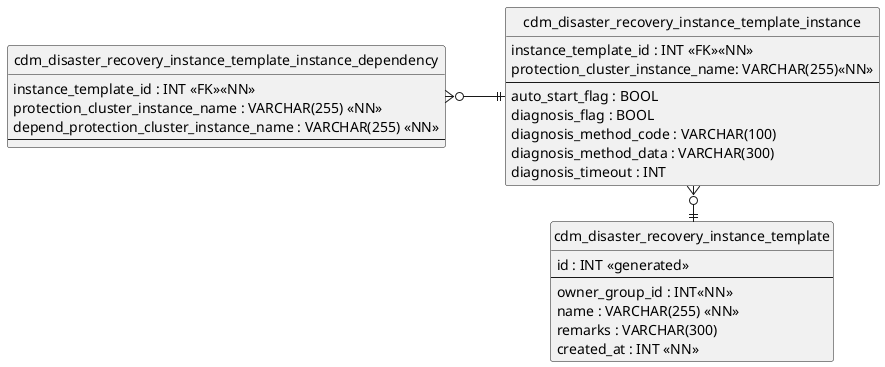

```plantuml
@startuml
left to right direction
skinparam linetype ortho
hide circle

entity cdm_disaster_recovery_instance_template {
  id : INT <<generated>>
  --
  owner_group_id : INT<<NN>>
  name : VARCHAR(255) <<NN>>
  remarks : VARCHAR(300)
  created_at : INT <<NN>>
}

entity cdm_disaster_recovery_instance_template_instance {
  instance_template_id : INT <<FK>><<NN>>
  protection_cluster_instance_name: VARCHAR(255)<<NN>>
  --
  auto_start_flag : BOOL
  diagnosis_flag : BOOL
  diagnosis_method_code : VARCHAR(100)
  diagnosis_method_data : VARCHAR(300)
  diagnosis_timeout : INT
}

entity cdm_disaster_recovery_instance_template_instance_dependency {
  instance_template_id : INT <<FK>><<NN>>
  protection_cluster_instance_name : VARCHAR(255) <<NN>>
  depend_protection_cluster_instance_name : VARCHAR(255) <<NN>>
  --
}


cdm_disaster_recovery_instance_template ||-l-o{ cdm_disaster_recovery_instance_template_instance
cdm_disaster_recovery_instance_template_instance ||-u-o{ cdm_disaster_recovery_instance_template_instance_dependency

@enduml
```
