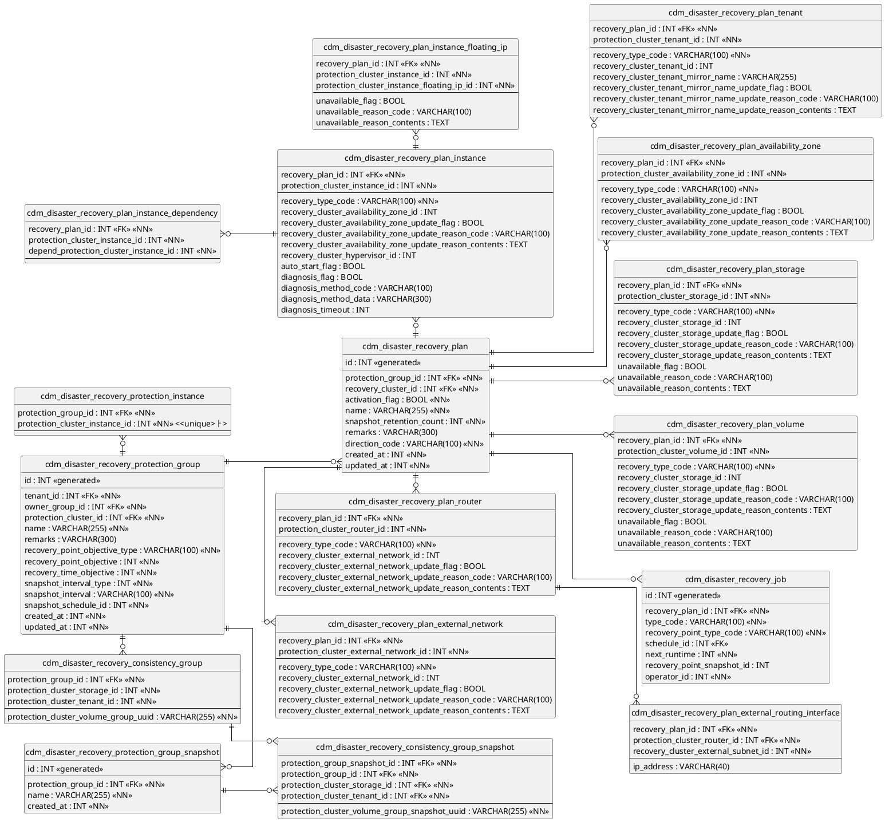

```plantuml
@startuml
left to right direction
skinparam linetype ortho
hide circle

entity cdm_disaster_recovery_protection_group {
  id : INT <<generated>>
  --
  tenant_id : INT <<FK>> <<NN>>
  owner_group_id : INT <<FK>> <<NN>>
  protection_cluster_id : INT <<FK>> <<NN>>
  name : VARCHAR(255) <<NN>>
  remarks : VARCHAR(300)
  recovery_point_objective_type : VARCHAR(100) <<NN>>
  recovery_point_objective : INT <<NN>>
  recovery_time_objective : INT <<NN>>
  snapshot_interval_type : INT <<NN>>
  snapshot_interval : VARCHAR(100) <<NN>>
  snapshot_schedule_id : INT <<NN>>
  created_at : INT <<NN>>
  updated_at : INT <<NN>>
}

entity cdm_disaster_recovery_protection_instance {
  protection_group_id : INT <<FK>> <<NN>>
  protection_cluster_instance_id : INT <<NN>> <<unique>ㅏ>
  --
}

entity cdm_disaster_recovery_protection_group_snapshot {
  id : INT <<generated>>
  --
  protection_group_id : INT <<FK>> <<NN>>
  name : VARCHAR(255) <<NN>>
  created_at : INT <<NN>>
}

entity cdm_disaster_recovery_consistency_group {
  protection_group_id : INT <<FK>> <<NN>>
  protection_cluster_storage_id : INT <<NN>>
  protection_cluster_tenant_id : INT <<NN>>
  --
  protection_cluster_volume_group_uuid : VARCHAR(255) <<NN>>
}

entity cdm_disaster_recovery_consistency_group_snapshot {
  protection_group_snapshot_id : INT <<FK>> <<NN>>
  protection_group_id : INT <<FK>> <<NN>>
  protection_cluster_storage_id : INT <<FK>> <<NN>>
  protection_cluster_tenant_id : INT <<FK>> <<NN>>
  --
  protection_cluster_volume_group_snapshot_uuid : VARCHAR(255) <<NN>>
}

entity cdm_disaster_recovery_plan {
  id : INT <<generated>>
  --
  protection_group_id : INT <<FK>> <<NN>>
  recovery_cluster_id : INT <<FK>> <<NN>>
  activation_flag : BOOL <<NN>>
  name : VARCHAR(255) <<NN>>
  snapshot_retention_count : INT <<NN>>
  remarks : VARCHAR(300)
  direction_code : VARCHAR(100) <<NN>>
  created_at : INT <<NN>>
  updated_at : INT <<NN>>
}

entity cdm_disaster_recovery_plan_tenant {
  recovery_plan_id : INT <<FK>> <<NN>>
  protection_cluster_tenant_id : INT <<NN>>
  --
  recovery_type_code : VARCHAR(100) <<NN>>
  recovery_cluster_tenant_id : INT
  recovery_cluster_tenant_mirror_name : VARCHAR(255)
  recovery_cluster_tenant_mirror_name_update_flag : BOOL
  recovery_cluster_tenant_mirror_name_update_reason_code : VARCHAR(100)
  recovery_cluster_tenant_mirror_name_update_reason_contents : TEXT
}

entity cdm_disaster_recovery_plan_availability_zone {
  recovery_plan_id : INT <<FK>> <<NN>>
  protection_cluster_availability_zone_id : INT <<NN>>
  --
  recovery_type_code : VARCHAR(100) <<NN>>
  recovery_cluster_availability_zone_id : INT
  recovery_cluster_availability_zone_update_flag : BOOL
  recovery_cluster_availability_zone_update_reason_code : VARCHAR(100)
  recovery_cluster_availability_zone_update_reason_contents : TEXT
}

entity cdm_disaster_recovery_plan_external_network {
  recovery_plan_id : INT <<FK>> <<NN>>
  protection_cluster_external_network_id : INT <<NN>>
  --
  recovery_type_code : VARCHAR(100) <<NN>>
  recovery_cluster_external_network_id : INT
  recovery_cluster_external_network_update_flag : BOOL
  recovery_cluster_external_network_update_reason_code : VARCHAR(100)
  recovery_cluster_external_network_update_reason_contents : TEXT
}

entity cdm_disaster_recovery_plan_router {
  recovery_plan_id : INT <<FK>> <<NN>>
  protection_cluster_router_id : INT <<NN>>
  --
  recovery_type_code : VARCHAR(100) <<NN>>
  recovery_cluster_external_network_id : INT
  recovery_cluster_external_network_update_flag : BOOL
  recovery_cluster_external_network_update_reason_code : VARCHAR(100)
  recovery_cluster_external_network_update_reason_contents : TEXT
}

entity cdm_disaster_recovery_plan_external_routing_interface {
  recovery_plan_id : INT <<FK>> <<NN>>
  protection_cluster_router_id : INT <<FK>> <<NN>>
  recovery_cluster_external_subnet_id : INT <<NN>>
  --
  ip_address : VARCHAR(40)
}

entity cdm_disaster_recovery_plan_storage {
  recovery_plan_id : INT <<FK>> <<NN>>
  protection_cluster_storage_id : INT <<NN>>
  --
  recovery_type_code : VARCHAR(100) <<NN>>
  recovery_cluster_storage_id : INT
  recovery_cluster_storage_update_flag : BOOL
  recovery_cluster_storage_update_reason_code : VARCHAR(100)
  recovery_cluster_storage_update_reason_contents : TEXT
  unavailable_flag : BOOL
  unavailable_reason_code : VARCHAR(100)
  unavailable_reason_contents : TEXT
}

entity cdm_disaster_recovery_plan_instance {
  recovery_plan_id : INT <<FK>> <<NN>>
  protection_cluster_instance_id : INT <<NN>>
  --
  recovery_type_code : VARCHAR(100) <<NN>>
  recovery_cluster_availability_zone_id : INT
  recovery_cluster_availability_zone_update_flag : BOOL
  recovery_cluster_availability_zone_update_reason_code : VARCHAR(100)
  recovery_cluster_availability_zone_update_reason_contents : TEXT
  recovery_cluster_hypervisor_id : INT
  auto_start_flag : BOOL
  diagnosis_flag : BOOL
  diagnosis_method_code : VARCHAR(100)
  diagnosis_method_data : VARCHAR(300)
  diagnosis_timeout : INT
}

entity cdm_disaster_recovery_plan_instance_dependency {
  recovery_plan_id : INT <<FK>> <<NN>>
  protection_cluster_instance_id : INT <<NN>>
  depend_protection_cluster_instance_id : INT <<NN>>
  --
}

entity cdm_disaster_recovery_plan_instance_floating_ip {
  recovery_plan_id : INT <<FK>> <<NN>>
  protection_cluster_instance_id : INT <<NN>>
  protection_cluster_instance_floating_ip_id : INT <<NN>>
  --
  unavailable_flag : BOOL
  unavailable_reason_code : VARCHAR(100)
  unavailable_reason_contents : TEXT
}

entity cdm_disaster_recovery_plan_volume {
  recovery_plan_id : INT <<FK>> <<NN>>
  protection_cluster_volume_id : INT <<NN>>
  --
  recovery_type_code : VARCHAR(100) <<NN>>
  recovery_cluster_storage_id : INT
  recovery_cluster_storage_update_flag : BOOL
  recovery_cluster_storage_update_reason_code : VARCHAR(100)
  recovery_cluster_storage_update_reason_contents : TEXT
  unavailable_flag : BOOL
  unavailable_reason_code : VARCHAR(100)
  unavailable_reason_contents : TEXT
}

entity cdm_disaster_recovery_job {
  id : INT <<generated>>
  --
  recovery_plan_id : INT <<FK>> <<NN>>
  type_code : VARCHAR(100) <<NN>>
  recovery_point_type_code : VARCHAR(100) <<NN>>
  schedule_id : INT <<FK>>
  next_runtime : INT <<NN>>
  recovery_point_snapshot_id : INT
  operator_id : INT <<NN>>
}

cdm_disaster_recovery_protection_group ||-l-o{ cdm_disaster_recovery_protection_instance
cdm_disaster_recovery_protection_group ||-r-o{ cdm_disaster_recovery_protection_group_snapshot
cdm_disaster_recovery_protection_group ||-r-o{ cdm_disaster_recovery_consistency_group
cdm_disaster_recovery_protection_group ||-d-o{ cdm_disaster_recovery_plan

cdm_disaster_recovery_protection_group_snapshot ||--o{ cdm_disaster_recovery_consistency_group_snapshot
cdm_disaster_recovery_consistency_group ||--o{ cdm_disaster_recovery_consistency_group_snapshot

cdm_disaster_recovery_plan ||--o{ cdm_disaster_recovery_plan_tenant
cdm_disaster_recovery_plan ||--o{ cdm_disaster_recovery_plan_availability_zone
cdm_disaster_recovery_plan ||-r-o{ cdm_disaster_recovery_plan_external_network
cdm_disaster_recovery_plan ||-r-o{ cdm_disaster_recovery_plan_router
cdm_disaster_recovery_plan_router ||--o{ cdm_disaster_recovery_plan_external_routing_interface
cdm_disaster_recovery_plan ||--o{ cdm_disaster_recovery_plan_storage
cdm_disaster_recovery_plan ||-l-o{ cdm_disaster_recovery_plan_instance
cdm_disaster_recovery_plan_instance ||-u-o{ cdm_disaster_recovery_plan_instance_dependency
cdm_disaster_recovery_plan_instance ||-l-o{ cdm_disaster_recovery_plan_instance_floating_ip
cdm_disaster_recovery_plan ||--o{ cdm_disaster_recovery_plan_volume
cdm_disaster_recovery_plan ||--o{ cdm_disaster_recovery_job

@enduml
```
