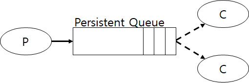
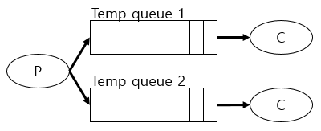

브로커(Broker) 라이브러리
-------------------------

-	CDM-Cloud 모듈 간 비동기 통신을 지원하기 위한 공용 라이브러리
-	go-micro/broker 와 go-plugins/rabbitmq 소스 코드를 수정해 적용하였으며, 기본 브로커는 Rabbitmq를 사용한다.

**통신 방법**

브로커 공용 라이브러리는 Rabbitmq의 큐(Queue)를 이용하여 Producer(Publisher)와 Consumer(Subscriber)간 통신이 이뤄지며, 큐의 특성에 따라 다음과 같이 두 가지 통신 방법을 지원한다.

1.	Persistent Queue  
	

	-	Producer나 Consumer에서 Rabbitmq로 연결을 시도할 때 생성되는 큐이며, 양쪽에서 모두 연결이 끊어져도 큐는 유지된다.
	-	옵션으로 전달된 값으로 Persistent 큐의 이름이 설정된다.
	-	이전 연결로 인해 동일한 이름의 큐가 존재할 경우 해당 큐에 연결된다.
	-	하나 혹은 여러 Consumer가 하나의 큐에 연결된다. 만약 여러 Consumer가 하나의 큐에 연결된 경우 Consumer는 교차로 메시지를 전달받는다.
	-	메시지 핸들러에서 발생하는 에러를 처리하기위해 RequeueOnError(Nack)를 지원한다.

2.	Temp Queue  
	

	-	Consumer가 Subscribe를 시도할 때 생성되는 큐이며 Consumer가 연결이 끊긴다면 큐 역시 사라진다.
	-	하나의 Consumer는 하나의 큐에 연결된다.
	-	큐의 이름은 임의로 설정되며 각 큐는 토픽(Topic)을 이용해 통신한다.
	-	동일한 토픽을 사용하는 큐는 동일한 메시지를 받아 여러 Consumer에게 전달할 수 있다.
	-	메시지 핸들러에서 발생하는 에러에 대한 책임을 지지않는다.

**Broekr 함수**

```go
// NewBroker 함수는 브로커 구조체를 생성한다.
func NewBroker(name, id, passwd string, opts ...Option) Broker

// Broker is an interface used for asynchronous messaging.
type Broker interface {
	//옵션 조회
	Options() Options
	//Broker로 연결
	Connect() error
	//Broker와 연결 종료
	Disconnect() error
	//큐로 메시지를 전달
	Publish(topic string, m *Message, opts ...PublishOption) error
	// PersistentQueue로부터 메시지를 Subscribe
	SubscribePersistentQueue(topic string, h Handler, requeueOnError bool) (Subscriber, error)
	// TempQueue로부터 메시지를 Subscribe
	SubscribeTempQueue(topic string, h Handler) (Subscriber, error)
}
```

**Default 함수**

```go
// RabbitMQ를 기본 Broker 로 사용할 때 호출하는 초기화 함수. 옵션에 대한 설명은 "옵션" 항목에서 설명한다.
func Init(id, passwd string, opts ...Option) error

// 기본 Broker 연결 함수
func Connect() error

// 기본 Broker 연결 해제 함수
func Disconnect() error

// 기본 Broker를 이용한 데이터 송신
func Publish(topic string, msg *Message, opts ...PublishOption) error

// 기본 Broker를 이용한 데이터 수신(Temp 큐 이용)
func SubscribeTempQueue(topic string, handler Handler) (Subscriber, error)

// 기본 Broker를 이용한 데이터 수신(Persistent 큐 이용)
// requeueOnError 가 true일 때, 핸들러 함수에서 에러를 리턴하면 메시지는 다시 큐에 들어간다
func SubscribePersistentQueue(topic string, handler Handler, requeueOnError bool) (Subscriber, error)  

```

**옵션**

```go

//서비스 이름 등록
func ServiceName(serviceName string) broker.Option

//Exchange 이름 등록. 옵션을 사용하지 않을 경우 Exchange이름은 default값으로 생성
func ExchangeName(exchangbeName string) broker.Option

//큐 이름을 매개변수로 사용하며, 설정될 경우 유지 가능하고 지속 가능한 큐를 미리 생성한다. 옵션을 사용하지 않을 경우 큐는 Temp큐로 생성된다.
func PersistentQueue(queueName string)    

```
